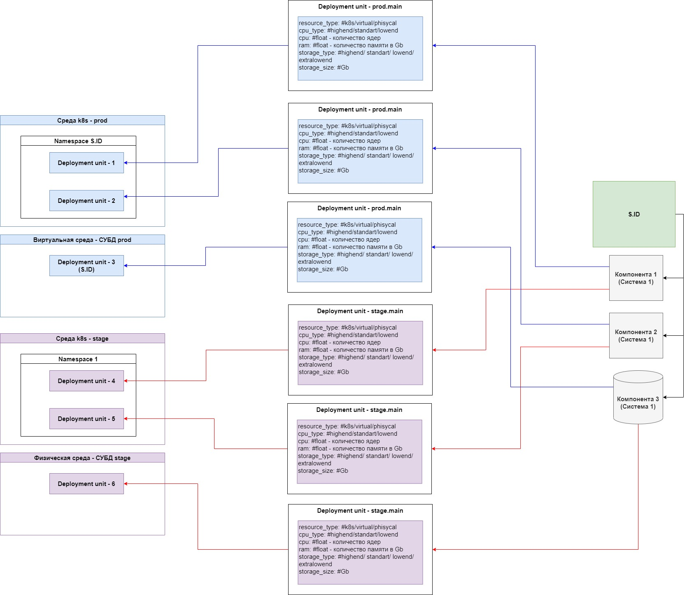

# Инструкции развертывания систем в ГК Болото

## Общее описание подхода

Для того чтобы достичь развернуть приложение нам необходимо:

1. Понять, где у нас размещается конкретная система, а это значит, что мы должны знать где располагается каждый её компонент. Например, для всех микросервисов базы данных "живут" отдельно от основных компонент системы и располагаются в отдельных средах.
2. На этапе планирования разработки новой или расширения текущей системы нам нужно посчитать сколько системе понадобится ресурсов и сколько они будут стоить.
3. Понять сколько у нас осталось свободных ресурсов в конкретной среде с учетом заложенных лимитов.

Для того чтобы технически выполнить действия, описанные выше, нам нужно каждый компонент системы, разложить на соответствующие единицы развертывания и к каждой из этих единиц развертывания указать требования к ресурсам. Эти единицы развертывания мы назвали deployment units (DU).

Общая схема описана ниже (схему нужно читать справа налево):



## Инструкция привязки DU к run-time компонентам системы

### Шаблоны deployment units (DU)

#### Шаблон DU для компонент разворачиваемых в среде k8s
```yaml
    deployment_units:
      prod.main: #<prod>.<имя du>
        resource_type: k8s #k8s/virtual/phisycal
        multiplier: 4        
        cpu: 0.1 #float - количество ядер
        ram: 0.125 #float - количество памяти в Gb

      stage.main: #<stage>.<имя du>
        resource_type: k8s #k8s/virtual/phisycal
        multiplier: 6        
        cpu: 0.1 #float - количество ядер
        ram: 0.125 #float - количество памяти в Gb

      dev.main: #<dev>.<имя du>
        resource_type: k8s #k8s/virtual/phisycal
        multiplier: 8
        cpu: 0.1 #float - количество ядер
        ram: 0.125 #float - количество памяти в Gb

```

#### Шаблон DU для компонент разворачиваемых не среде k8s

Обратите внимание что для DU разворачиваемых **не** среде k8s нет унифицированных требований к cpu, ram и storage_size, поэтому вам нужно их заполнить вручную.

```yaml
    deployment_units:
      prod.main: #<prod>.<имя du>
        resource_type: virtual #virtual/phisycal
        multiplier: 1
        cpu_type: standart #highend/standart
        cpu: <указать> #int - количество ядер процессора
        ram: <указать> #int - количество памяти в Gb
        storage_type: <указать> standart #highend/standart/lowend/extralowend
        storage_size: <указать> #Gb

      stage.main: #<stage>.<имя du>
        resource_type: virtual #virtual/phisycal
        multiplier: 1
        cpu_type: standart #highend/standart
        cpu: <указать> #float - количество ядер процессора
        ram: <указать> #float - количество памяти в Gb
        storage_type: standart #highend/standart/lowend/extralowend
        storage_size: <указать> #Gb

      dev.main: #<dev>.<имя du>
        resource_type: virtual #k8s/virtual/phisycal
        multiplier: 1
        cpu_type: standart #standart/lowend
        cpu: <указать> #float - количество ядер процессора
        ram: <указать> #float - количество памяти в Gb
        storage_type: <указать> standart #highend/standart/lowend/extralowend
        storage_size: <указать> #Gb
```

### Рекомендации по установке параметра multiplier у DU для сред k8s

#### Продуктовой среды (PROD)

Для продуктовых сред рекомендуется устанавливать multiplier равный **4**, поскольку при использовании Canary или B/G деплоев - необходимо поддерживать два инстанса одного приложения, помимо этого при установке релизов происходит Rolling update (выкатывается полностью новый, затем убивается старый). Помимо этого необходимо иметь ресурсы в запасе для скалирования сервисов, при повышенной нагрузке.

#### Стейдж-среды (STAGE)

Для стейдж-сред рекомендуется устанавливать multiplier равный **6**, т.к STAGE среда подразумевает предрелизную подготовку, с возможным выкатыванием нескольких копий одного релиза (scale), или нескольких релизов. В дополнение, на STAGE окружении подразумевается выкатка БД для проверок интеграций с базами.

#### Среды разработки (DEV)

Для сред разработки рекомендуется устанавливать multiplier равный **8**, т.к. DEV среда подразумевает под собой активную разработку и выкатывание нескольких инстансов одного сервиса. В DEV выкатываются все feature ветки. В дополнение, на DEV окружении подразумевается выкатка БД для проверок интеграций с базами.

### Действия в DocHub

Для реализации привязки DU к run-time компонентам системы необходимо добавлять массив используемых DU в раздел "deployment_units". В качестве идентификатора DU было решено использовать доменную структуру вида <тип среды>.<имя DU>:

```yaml
components:
  swamp.crocodile.srole.app:
    title: Основное приложение
    entity: component
    technologies:
      - Python
      - Django
      - Django REST Framework
      - Faust
    links:
      - id: swamp.crocodile.srole.db_postgresql
        direction: -->
      - id: swamp.crocodile.srole.redis_master
        direction: -->
      - id: swamp.crocodile.srole.celery
        direction: -->
    deployment_units:
      prod.main: #<prod>.<имя du>
        resource_type: k8s #k8s/virtual/phisycal
        multiplier: 4
        cpu_type: standart #highend/standart/lowend
        cpu: 0.1 #float - количество ядер
        ram: 0.125 #float - количество памяти в Gb

      stage.main: #<stage>.<имя du>
        resource_type: k8s #k8s/virtual/phisycal
        multiplier: 6
        cpu_type: standart #highend/standart/lowend
        cpu: 0.1 #float - количество ядер
        ram: 0.125 #float - количество памяти в Gb

      dev.main: #<dev>.<имя du>
        resource_type: k8s #k8s/virtual/phisycal
        multiplier: 8
        cpu_type: standart #highend/standart/lowend
        cpu: 0.1 #float - количество ядер
        ram: 0.125 #float - количество памяти в Gb

  swamp.crocodile.srole.db:
      title: СУБД
      entity: database # для СУБД нужно указывать именно database
      technologies:
        - PostgreSQL
      deployment_units:
        prod.main: #<prod>.<имя du>
          resource_type: virtual #k8s/virtual/phisycal
          multiplier: 1
          cpu_type: standart #standart/lowend
          cpu: 24 #float - количество ядер
          ram: 128 #float - количество памяти в Gb
          storage_type: standart #highend/standart/lowend/extralowend
          storage_size: 100 #Gb

        stage.main: #<stage>.<имя du>
          resource_type: virtual #k8s/virtual/phisycal
          multiplier: 1
          cpu_type: standart #standart/lowend
          cpu: 24 #float - количество ядер
          ram: 128 #float - количество памяти в Gb
          storage_type: highend #highend/standart/lowend/extralowend
          storage_size: 100 #Gb

        stage.slave: #<stage>.<имя du>
          resource_type: virtual #k8s/virtual/phisycal
          multiplier: 1
          cpu_type: standart #standart/lowend
          cpu: 12 #float - количество ядер
          ram: 64 #float - количество памяти в Gb
          storage_type: standart #highend/standart/lowend/extralowend
          storage_size: 100 #Gb

        dev.main: #<dev>.<имя du>
          resource_type: virtual #k8s/virtual/phisycal
          multiplier: 1
          cpu_type: standart #standart/lowend
          cpu: 24 #float - количество ядер
          ram: 128 #float - количество памяти в Gb
          storage_type: standart #highend/standart/lowend/extralowend
          storage_size: 100 #Gb
```
Бывает так, что одна компонента требует разных ресурсов, в этом случае для этой компоненты нужно делать DU под каждые требования. Например, БД SQL может требовать разных дисков для TEMP DB, логов и данных, в этом случае для этой компоненты нужно создать три разных DU каждый со своими требованиями.

Так как для разворачивания run-time компонент могут быть задействованы разные команды DocHub даёт возможность автоматически создавать одновременно 3 вида заявок:
1. Если у DU указано resource_type: **k8s**, то заявка создается на команду DevOps
2. Если у DU указано resource_type: **virtual** или **phisycal** и entity: **component**, то заявка создается на команду инфраструктуры отвечающую за разворачивание систем.
3. Если у DU указано resource_type: **virtual** или **phisycal** и entity: **database**, то заявка создается на команду инфраструктуры отвечающую за разворачивание СУБД.

## Инструкция по развёртыванию системы в средах

Следуйте плану ниже:
1. Внесите DU в DocHub c нужными ресурсами в репозиторий согласно инструкции выше
2. Зайдите в список систем и выберете Карточку развертывания

3. Проверьте корректность внесенных данных


